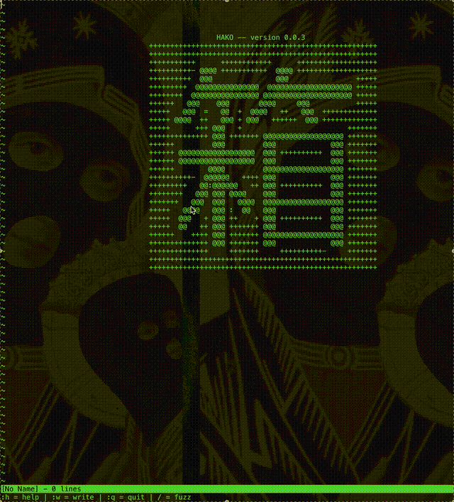

# 箱 Hako


## Overview
In a minimalistic terminal environment, Hako contains your code without distraction.
A lean, focused text editing tool; 
designed for engineers who appreciate clarity, precision, and the elegance of minimalism.

---

## Usage
#### Compile `hako.c`(ex. gcc)
```bash
gcc hako.c -o hako
```
#### Then launch it with:
```bash
./hako or ./hako [yourfile]
```
#### Alternatively
You may run the pre-compiled `./hako` file.

Your terminal becomes a box that holds your code, structured and serene.

---

## Current Timeline

- Broadening syntax support
	- `c`						[X]
	- `c++`						[ ]
	- `c#`						[ ]
	- `python`					[X]
	- `java`					[ ]
	- `rust`					[ ]
	- `SQL`						[ ]
	- `html/css`				[ ]

- Establishing a `.hakorc`file for configs
	- create .hakorc			[ ]
	- number settings			[ ]
	- establish default theme	[ ]

- Refine and create new key bindings
	- modes						[ ]
	- global identifer			[ ]

---

## Contributing

If you share the belief that simplicity empowers creativity, feel free to contribute.

#### Contribution is welcome in the form of:
- Forking this repo
- Submiting a Pull Request
- Bug reports and feature requests

Please ensure your code follows the existing style.

---

## Thank you for your attention.
If you hit any issues, feel free to open an issue on GitHub.
Pull requests, suggestions, or even thoughtful discussions are welcome.

