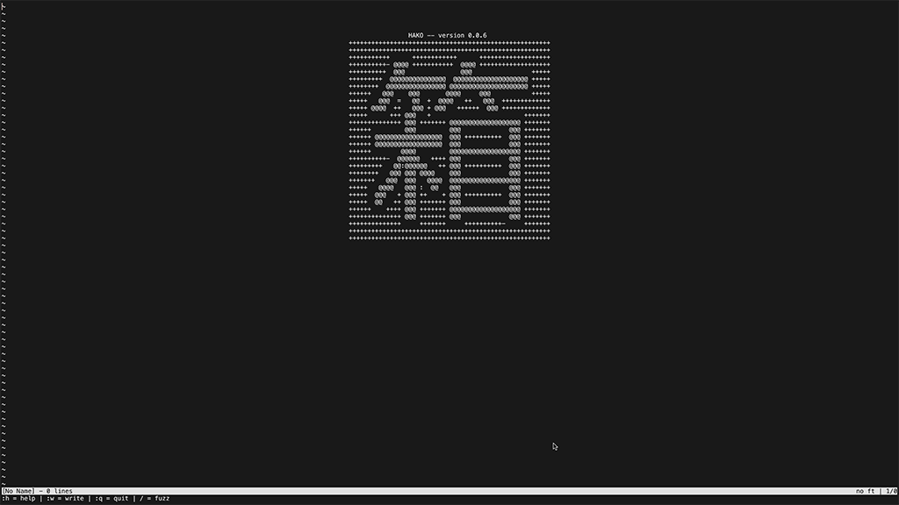
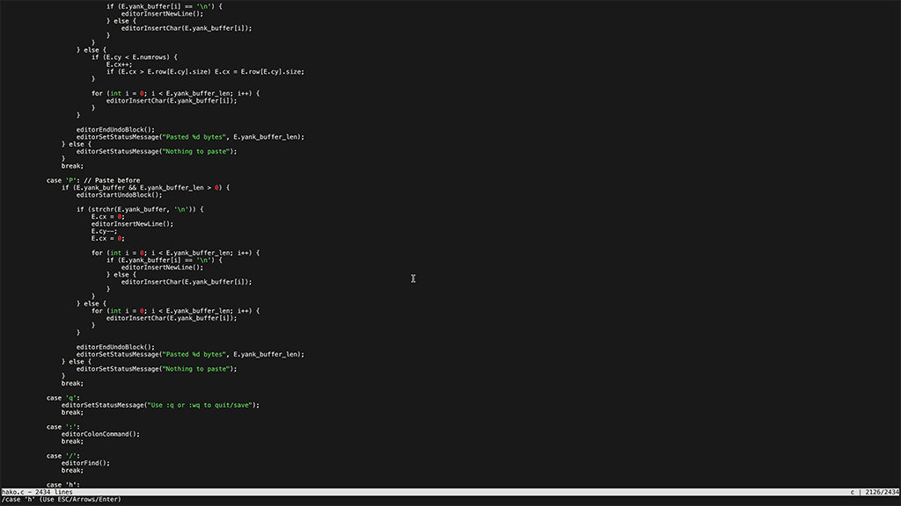
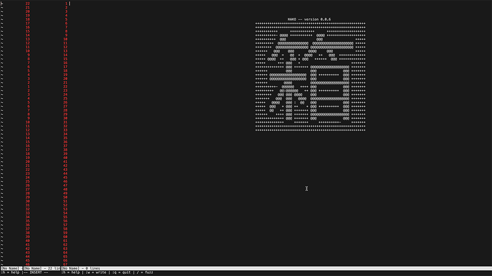
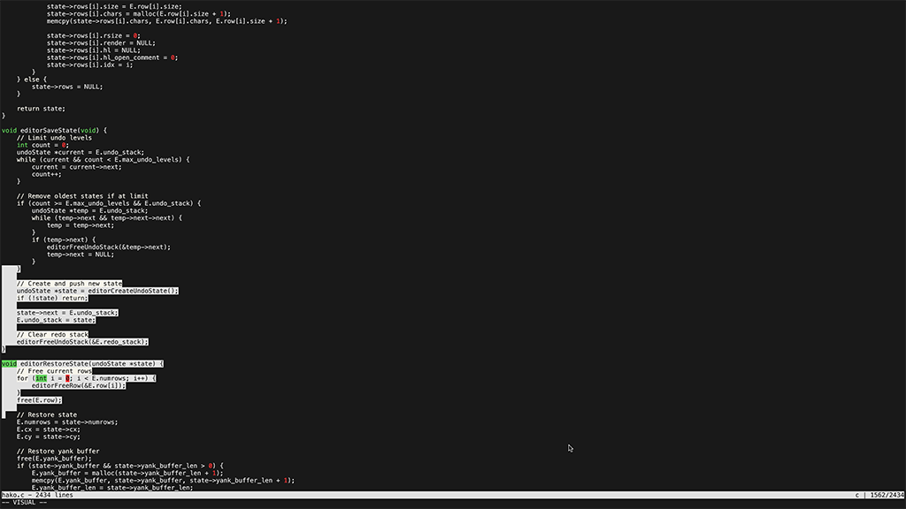
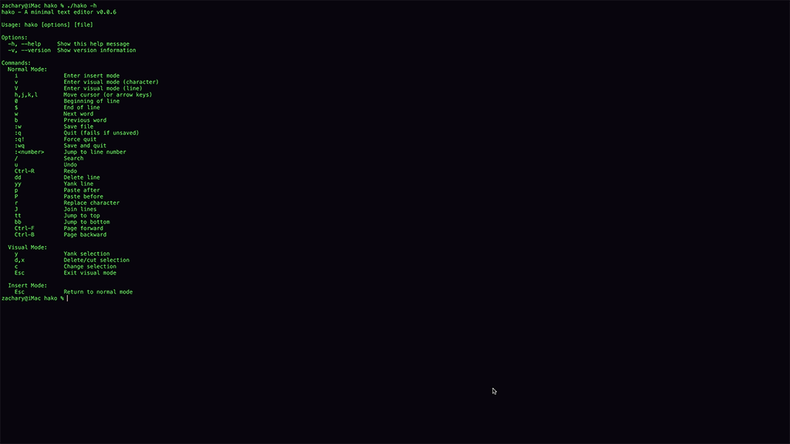

# 箱 Hako

## Overview
In a minimalistic terminal environment, Hako contains your code without distraction.
A lean, focused text editing tool; 
designed for engineers who appreciate clarity, precision, and the elegance of minimalism.
<br>
<p align="center">
  
  <br>
  [Clean, distraction-free editing]
</p>
<br>
<table align="center">
  <tr>
    <td align="center">
      <br/>
      [Syntax highlighting]
    </td>
    <td align="center">
      <br/>
      [Line numbering]
    </td>
  </tr>
  <tr>
    <td align="center">
      <br/>
      [Visual Mode]
    </td>
    <td align="center">
      <br/>
      [Help system]
    </td>
  </tr>
</table>

---

## Change Log
[v0.0.6]

*Features & Quality of Life*
- Full visual mode implementation (v for character, V for line selection)
- Complete copy/paste system with yank buffer (y to copy, p/P to paste)
- Additional vim motions: w/b (word movement), 0/$ (line start/end)
- Character replacement with r, line joining with J
- Enhanced help system (:help in editor, -h/--help from command line)
- New file creation - editing non-existent files creates them on save
- Improved terminal cleanup on exit

*Bug Fixes*
- Fixed undo/redo segfault when undoing paste operations
- Resolved terminal color persistence after exit
- Corrected visual selection boundary handling
- Fixed edge cases with empty line selections


[v0.0.5]
*Features & Quality of Life*
- While I'm not looking to create another neovim, there are many features of vim I do enjoy
- More vi-like functionality with undo (u in normal)/redo (ctrl + r in normal) blocks
- Undo blocks function with time, action, and mode based boundries
- Configuarable undo levels, located in .hakorc (default=100)
- Options for number and relative number mode, replacing (ex. "~" with "1") available in .hakorc
- Number mode currently supports up 4 characters (ex. 9999 lines) 

*Bug Fixes*
- Fixed terminal crashing from invalid line jumps
- Corrected cursor positioning and edge cases partaining to empty file navigation
- Removed duplicate code and minor debug output left in from previous testing

[v0.0.2-0.0.4]
- Added familiar vi-inspired modes & commands (normal & insert, /, :, :w, :wq, :q); susceptible to change
- Line jump fuction via :NUMBER (ex. :120 goes to line 120)
- Ctrl + f pages fwd ctrl + b pages bwd
- Implemented tt (go to line 1) and bb (go to last line) normal mode shortcuts
- Improved the fuzzy find triggered by /, use arrow keys or scroll to move between finds, enter/esc to exit
- Added language support for c++, c#, java, Rust, SQL, HTML/CSS, and Javascript (in addition to Python & C)
- Established default font color theme, found in .hakorc
- Alternate-screen & clean exit, wiping the terminal

---

## Usage
#### Compile `hako.c`(ex. gcc)
```bash
gcc hako.c -o hako
```
#### Then launch it with:
```bash
./hako or ./hako [yourfile]
```

Your terminal becomes a box that holds your code, structured and serene.

---

## Current Timeline

- Broadening syntax support
	- `C` [X]
	- `C++` [X]
	- `C#` [X]
	- `Python` [X]
	- `Java` [X]
	- `Rust` [X]
	- `SQL` [X]
	- `HTML/CSS` [X]
	- `Javascript` [X]
	- 'markdown' [ ]
	- New syntax support in progress

- Establishing a `.hakorc`file for configs
	- create .hakorc [X]
	- various settings [tabs, hotkeys, etc] [X]
	- establish default theme [X]
	- enhanced theme support [ ]
	- rig settings like theme color, number mode, etc to .hakorc [X]
	- prime for plugin support [ ]

- Refine and create new key bindings
	- modes [insert, normal] [X]
	- / for search [X]
	- implement replace via / [ ]
	- :q for quit :w for write [X]
	- undo/redo [X]
	- copy/paste [X]
	- line # search [X]
	- ctrl + f jump forward, ctrl + b jump back	[X]
	- tt for top bb for bottom [X]
	- numbered mode, with ordered and relative options [X]
	- visual mode [X]
	- yy yank line, y for yank (in visual/line) [X]
	- dd for delete line (in normal) [X]
	- delete all [ ]
	- copy all [ ]
	- split window editing [ ]
	- modulate and parse code seperately [ ]
	- cleaned code, comments for referencing and contributing [X]

- AI implementation
	- optional agnostic AI implementation (local, claude, gpt, etc) [ ]
	- AI code referencing [ ]

---

## Contributing
If you share the belief that simplicity empowers creativity, feel free to contribute.

#### Contribution is welcome in the form of:
- Forking this repo
- Submiting a Pull Request
- Bug reports and feature requests

Please ensure your code follows the existing style.

---

## Thank you for your attention.
If you hit any issues, feel free to open an issue on GitHub.
Pull requests, suggestions, or even thoughtful discussions are welcome.
