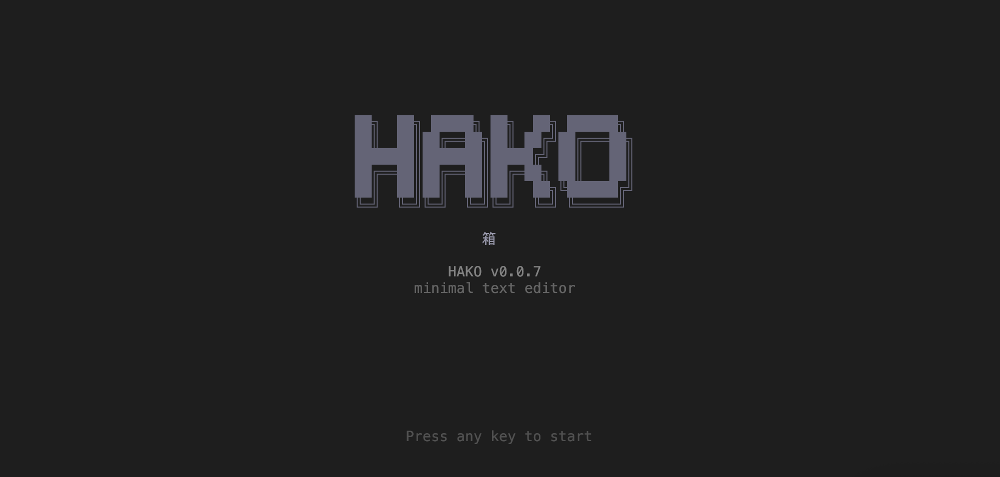
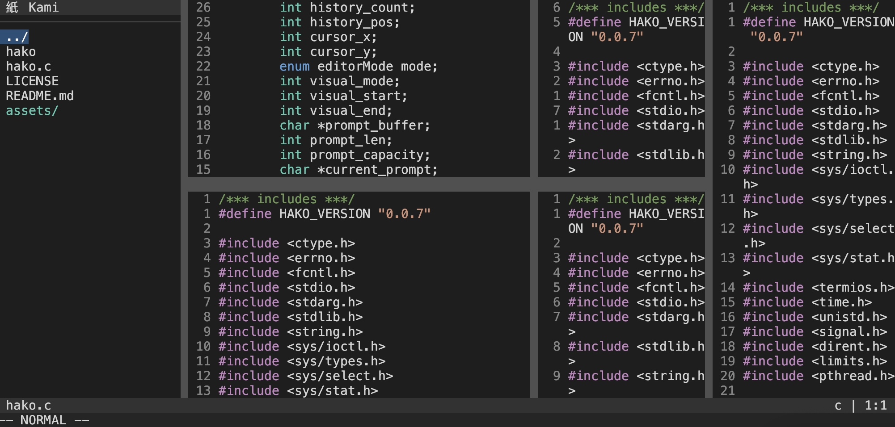
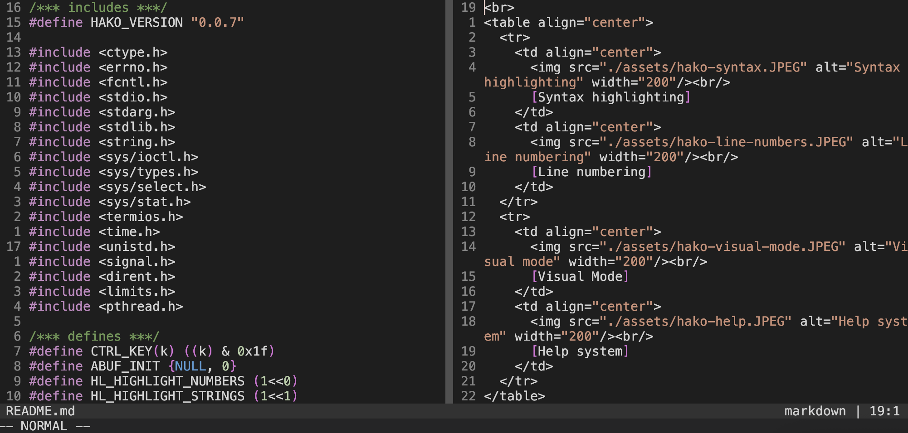
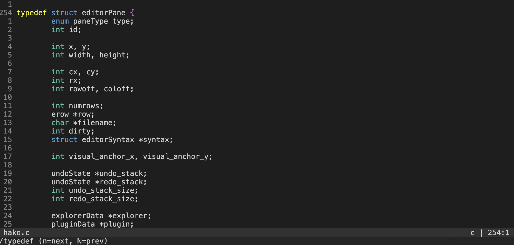
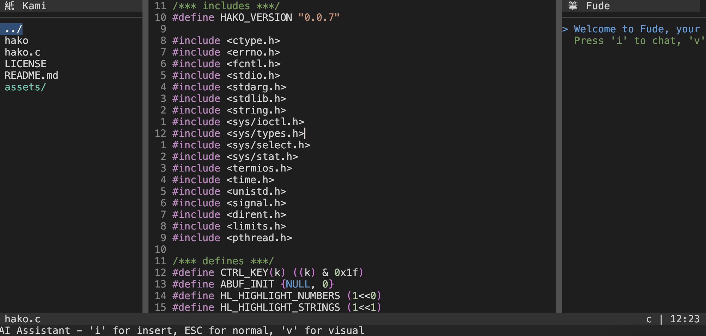

# 箱 HAKO
## Overview
A minimalistic modal text environment, containing your code without distraction.<br>

<p align="center">
	<br>
</p><br>
<table align="center">
	<tr>
		<td align="center">
			<br/>
			[Explorer Pane]
		</td>
		<td align="center">
			<br/>
			[Split Window Panes]
		</td>
	</tr>
	<tr>
		<td align="center">
			<br/>
			[Search/Replace]
		</td>
		<td align="center">
			<br/>
		[AI Integration Coming]
		</td>
	</tr>
</table><br>

- **Modal Editing**: Vi-inspired normal, insert, visual, and visual-line modes
- **Multi-Pane Support**: Split windows horizontally and vertically
- **File Explorer**: Built-in directory navigation with hidden file toggle
- **Syntax Highlighting**: Support for 40+ programming languages
- **Undo/Redo**: Intelligent undo blocks with configurable history depth
- **Visual Selection**: Character and line-based selection with yank/delete operations
- **Fast Search**: Incremental search with next/previous navigation
- **Line Numbers**: Absolute or relative numbering modes
- **Customizable**: Configuration via `.hakorc` file

## Launch Hako
Compile
```
# Grab a C compiler (ex. gcc)
gcc hako.c -o hako
```
Run
```
# If not installed, from file path
./hako or ./hako [filename]

# If installed, from anywhere
hako or hako [filename]
```
"Install"
```
# From file path (Mac)
cp hako /usr/local/bin/hako 

# From file path (Linux)
cp hako /usr/local/bin/hako
```

## Key Bindings

### Normal Mode

|Key      |Action                 |
|---------|-----------------------|
|`i`      |Enter insert mode      |
|`v`      |Visual mode (character)|
|`V`      |Visual mode (line)     |
|`h,j,k,l`|Navigate (←↓↑→)        |
|`w,b`    |Next/previous word     |
|`0,$`    |Start/end of line      |
|`gg,G`   |Top/bottom of file     |
|`dd`     |Delete line            |
|`yy`     |Yank (copy) line       |
|`p,P`    |Paste after/before     |
|`u`      |Undo                   |
|`Ctrl-R` |Redo                   |
|`/`      |Search                 |
|`n,N`    |Next/previous match    |
|`:w`     |Save                   |
|`:e [filename]`     |Open file   |
|`:q`     |Quit                   |
|`:wq`    |Save and quit          |

### Window Management

|Key       |Action          |
|----------|----------------|
|`Ctrl-W s`|Split horizontal|
|`Ctrl-W v`|Split vertical  |
|`Ctrl-W w`|Switch pane     |
|`Ctrl-W c`|Close pane      |

### File Explorer

|Key        |Action             |
|-----------|-------------------|
|`:e,:explorer`|Toggle explorer |
|`j,k`      |Navigate files     |
|`h,l`      |Parent/open        |
|`.`        |Toggle hidden files|

## Configuration

Use supplied config, or HAKO will generate a `.hakorc` file in your home directory or project folder.

## Supported Languages

HAKO provides syntax color for 40+ languages, some of which include:

**Systems**: C, C++, Rust, Go, Zig, Assembly  
**Scripting**: Python, Ruby, Perl, Lua, Shell, PHP  
**Web**: JavaScript, TypeScript, HTML, CSS, JSON  
**JVM**: Java, Kotlin, Scala, Clojure  
**Functional**: Haskell, OCaml, F#, Elixir  
**Modern**: Swift, Dart, Julia, Nim  
**Config**: YAML, TOML, Dockerfile, Makefile

## Change Log

### v0.0.7 (Latest)<br>
Huge update to the previous version
- New splash
- Complete visual mode implementation (v/V)
- Full copy/paste system with yank buffer
- Additional vim motions (w/b, 0/$, r, J)
- Screen splitting
- Explorer panel
- Enhanced help system
- Improved terminal cleanup
- Themes in .hakorc
- Beginning of AI implementation (aesthetically, via ":ai" command)
Hope I am not leaving anything out here, but this update is big enough I may be

### Previous Versions
<details>
<summary>Previous Changes</summary>

***v0.0.6***<br>
Features & Quality of Life
- Full visual mode implementation (v for character, V for line selection)
- Complete copy/paste system with yank buffer (y to copy, p/P to paste)
- Additional vim motions: w/b (word movement), 0/$ (line start/end)
- Character replacement with r, line joining with J
- Enhanced help system (:help in editor, -h/--help from command line)
- New file creation - editing non-existent files creates them on save
- Improved terminal cleanup on exit

Bug Fixes
- Fixed undo/redo segfault when undoing paste operations
- Resolved terminal color persistence after exit
- Corrected visual selection boundary handling
- Fixed edge cases with empty line selections

***v0.0.5***<br>
Features & Quality of Life
- While I'm not looking to create another neovim, there are many features of vim I do enjoy
- More vi-like functionality with undo (u in normal)/redo (ctrl + r in normal) blocks
- Undo blocks function with time, action, and mode based boundaries
- Configurable undo levels, located in .hakorc (default=100)
- Options for number and relative number mode, replacing (ex. "~" with "1") available in .hakorc
- Number mode currently supports up 4 characters (ex. 9999 lines)

Bug Fixes
- Fixed terminal crashing from invalid line jumps
- Corrected cursor positioning and edge cases pertaining to empty file navigation
- Removed duplicate code and minor debug output left in from previous testing

**v0.0.4**
- Added familiar vi-inspired modes & commands (normal & insert, /, :, :w, :wq, :q)
- Line jump function via :NUMBER (ex. :120 goes to line 120)
- Ctrl + f pages fwd ctrl + b pages bwd

**v0.0.3**
- Implemented tt (go to line 1) and bb (go to last line) normal mode shortcuts
- Improved the fuzzy find triggered by /, use arrow keys or scroll to move between finds, enter/esc to exit
- Added language support for c++, c#, java, Rust, SQL, HTML/CSS, and Javascript (in addition to Python & C)

**v0.0.2**
- Established default font color theme, found in .hakorc
- Alternate-screen & clean exit, wiping the terminal

**v0.0.1**
- Initial push
- Basic text editing
- Ability to save and load files
</details>

## Roadmap
- [ ] **v0.0.8**: Agnostic AI integration for code assistance, local LLM or major models via your API (grok, gpt, claude, ollama)

## Contributing
If you share the belief that simplicity empowers creativity, feel free to contribute.

#### Contribution is welcome in the form of:
- Forking this repo
- Submitting a Pull Request
- Bug reports and feature requests

Please ensure your code follows the existing style. I realize the single file is a personal choice, though if you choose to assist, I have divided the code.<br>

Sections of codebase are as follows:
1. Includes
2. Defines
3. Enums
4. Struct Declarations
5. Function Prototypes
6. Syntax Highlighting
7. Terminal
8. Buffer
9. Helpers
10. Color
11. Clipboard
12. Pane Management
13. Row Operations
14. Editor Operations
15. Cursor Movement
16. Scrolling
17. Visual Mode
18. Undo/Redo
19. Search
20. File I/O
21. Drawing
22. Input
23. Mode and Commands
24. Main Drawing Functions
25. Input Processing
26. Splash Screen
27. Explorer
28. AI Assistant
29. Init
30. Main

## Thank you for your attention.
This project started out of curiosity and a simple C text editor tutorial. If you hit any issues, feel free to open an issue on GitHub.
Pull requests, suggestions, or even thoughtful discussions are welcome.
